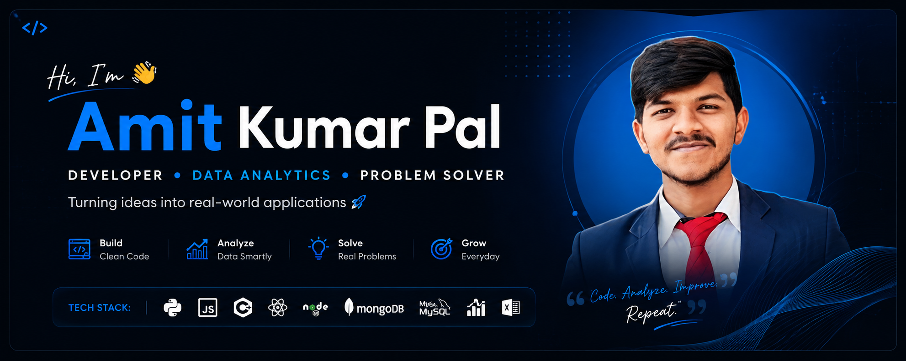

  

<h2 align="center">
  Computer Science Graduate • Developer • Data Analytics • Problem Solver 🚀
</h2>

  Turning ideas into practical applications and data-driven solutions.

  

---

## 👨‍💻 About Me

- 🎓 Computer Science Graduate
- 💻 Interested in software development and practical applications
- 📊 Currently focused on **Data Analytics, Python, SQL, Excel & Power BI**
- 🚀 I enjoy building real-world projects and experimenting with new technologies
- 🧠 Continuously improving my development and problem-solving skills
- 📍 India

---

## 🛠️ Tech Stack

---
## 🚀 Featured Projects

### 🎬 Local Flix
Offline desktop media library built with Electron.

**Tech:** Electron • JavaScript • HTML • CSS

---

### 📊 Data Analytics Projects
Practical analytics projects using Python, SQL, Excel and Power BI.

**Focus:** Data Cleaning • Analysis • Visualization • Business Insights

---

### 🌐 Personal Portfolio
My personal portfolio showcasing my projects, skills and experience.

**Tech:** HTML • CSS • JavaScript

---
## 🤝 Connect With Me

---

  <b>💡 Build • Analyze • Solve • Grow</b>

